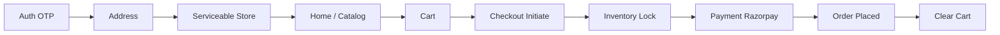

# Phase 4 Customer Shopping Architecture

## Goal

Phase 4 defines the **customer shopping experience**: location-based store selection,
browsing, cart, checkout preparation, payment, and order placement.

This document is **architecture-only** (Module 0). It does not implement backend
logic, customer-app screens, Mongoose models, or payment SDK integration.

**Sources:**

- `projectin micro/docone/AllPhase&Modules.pdf` (Phase 4, pages 43–57)
- `projectin micro/docfour/PhaesDetail4&5.pdf` (Modules 1–15 micro-tasks, pages 1–54)

**Prerequisites:**

- Phase 1 foundation (monorepo, backend shell, database conventions).
- Phase 2 customer OTP auth, RBAC, sessions.
- Phase 3 catalog read, stores, store-products, inventory, inventory locks, customer
  catalog UI (Add to Cart placeholder only).

Closeout references: `docs/handoffs/phase-3-integration-review-complete.md`,
`docs/reviews/phase-1-3-execution-completion-report.md`.

**Phase 4 integration closeout (Module 15):** `docs/architecture/phase-4-integration-review.md`,
`docs/contracts/phase-4-module-completion-matrix.md`,
`docs/handoffs/phase-4-integration-review-complete.md`.

## Phase 4 Objective

Enable the customer journey:

```text
login → select address → resolve serviceable store → browse home/catalog
  → add to cart → checkout (validate + reserve stock) → pay (Razorpay)
  → place order → view order confirmation / history
```

## Backend Authority Rule

The backend is the system of record for:

- Store serviceability and selected `storeId`
- Cart contents, price snapshots, and totals
- Checkout validation and inventory reservation (via Phase 3 locks)
- Payment verification and idempotency
- Order creation and inventory confirmation

Customer App owns UX, navigation, and optimistic UI only. It must not compute
final payable amounts or confirm stock without server responses.

## Customer Journey (Logical Flow)



## Planned Data Collections (Summary)

Detail in `docs/database/*` (Module 0 Tickets 3–7):

| Collection | Purpose |
|------------|---------|
| `customer_addresses` | Saved delivery addresses, default flag, coordinates |
| `carts` | Per-customer per-store active cart and line items |
| `checkout_sessions` | Checkout state, reservation linkage, TTL |
| `payments` | Razorpay order/payment records, idempotency |
| `orders` | Placed order snapshots (placement scope in Phase 4) |

Phase 3 collections consumed (not owned by Phase 4): `stores`, `store_products`,
`inventory_stocks`, `inventory_locks`, catalog entities.

## Planned API Route Families

All routes are **PLANNED** until owning modules implement controllers.

| Family | Prefix | Module |
|--------|--------|--------|
| Addresses & serviceability | `/api/v1/customer/addresses`, `/api/v1/customer/serviceability` | 1 |
| Home / shopping entry | `/api/v1/customer/home` | 2 |
| Cart | `/api/v1/customer/cart` | 3 |
| Checkout | `/api/v1/customer/checkout` | 6 |
| Payments | `/api/v1/customer/payments` | 8 |
| Orders | `/api/v1/customer/orders` | 10 |
| Profile | `/api/v1/customer/profile` | 12 |
| Catalog (existing) | `/api/v1/customer/catalog/*` | Phase 3 |

Webhook (planned): `POST /api/v1/webhooks/razorpay` (exact mount in route plan).

## Phase 4 Modules (PDF Order)

| # | Module | Purpose |
|---|--------|---------|
| 0 | Phase 4 Foundation & Bootstrap | Docs, contracts, schemas (this module) |
| 1 | Customer Location & Store Selection | Addresses, nearest store, unserviceable handling |
| 2 | Customer Home & Shopping Entry | Home feed API and customer-app home screen |
| 3 | Cart Backend Foundation | Cart model and CRUD APIs |
| 4 | Customer App Cart Experience | Cart UI, add-to-cart on listing/detail, bottom bar |
| 5 | Pricing & Cart Calculation | Totals, price snapshots, price-change detection |
| 6 | Checkout Preparation Backend | Validate, reserve inventory, summary, expiry |
| 7 | Customer App Checkout Flow | Checkout screen, reservation timer, errors |
| 8 | Payment Gateway Foundation | Razorpay order, verify, webhook, idempotency |
| 9 | Customer App Payment Flow | Razorpay SDK, verify, failure/retry UI |
| 10 | Order Creation Backend | Create order, confirm stock, clear cart, history APIs |
| 11 | Customer App Order Confirmation | Success, detail, history screens |
| 12 | Basic Customer Profile | Profile GET/PATCH, profile screen |
| 13 | Customer App Search & Browsing Improvements | Search/category pagination, OOS states |
| 14 | Phase 4 Testing & Validation | API, cart, checkout, payment, order tests |
| 15 | Phase 4 Integration & Review | E2E journey, handoff, Phase 5 gate |

## Surface Scope

| Surface | Phase 4 role |
|---------|----------------|
| **Customer App** | Primary — address, home, cart, checkout, payment, orders, profile |
| **Backend API** | All business logic for Phase 4 domains |
| **Admin Dashboard** | No Phase 4 feature modules in PDF (catalog/store from Phase 3 only) |
| **Vendor Panel** | No Phase 4 feature modules in PDF |
| **Delivery Agent App** | Out of scope for Phase 4 |

## Inventory Lock Dependency (Phase 3)

Checkout reservation uses Phase 3 **inventory locks** (MongoDB `inventory_locks`):

- Create lock on checkout initiate → reserves `availableQuantity`
- Release on payment failure / TTL expiry
- Confirm on successful order placement

Reference: `docs/contracts/inventory-locking-api.md`,
`docs/architecture/phase-4-inventory-lock-integration.md` (Module 0).

## Out of Scope (Phase 4)

Deferred to **Phase 5+**:

- Order lifecycle state machine (picking, packing, ready-for-pickup)
- Store acceptance, vendor incoming orders, admin order operations
- Delivery assignment, live tracking, rider location
- Promotions, coupons, automatic offers (Phase 9+)
- Refunds and ledger (Phase 9+)
- Real-time WebSocket order updates (Phase 7+)

**Not in scope for any Phase 4 ticket:**

- Re-running Phase 1 Repository & Codebase Setup
- Admin/vendor web panels for orders

## Related Documents (Module 0)

- `docs/architecture/phase-4-module-dependencies.md`
- `docs/architecture/phase-4-backend-file-structure.md`
- `docs/architecture/phase-4-customer-app-file-structure.md`
- `docs/architecture/phase-4-inventory-lock-integration.md`
- `docs/architecture/phase-4-audit-logging.md`
- `docs/architecture/phase-4-shared-contracts.md`
- `docs/contracts/*` (address, cart, checkout, payment, order, home)
- `docs/database/*` (schemas, index plan, seed plan)

## API Endpoints

No API endpoints are implemented in this document.

## DB Fields

No database fields are created in this document.
