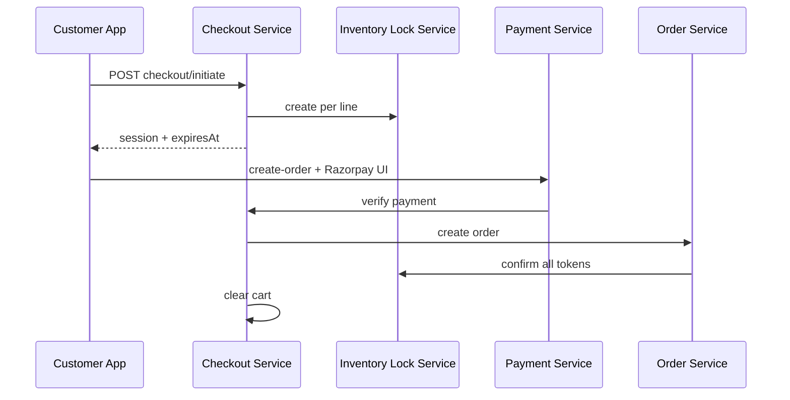

# Phase 4 Inventory Lock Integration

Status: **IMPLEMENTED** — checkout initiate/cancel/expiry (Module 6, 2026-05-19); lock confirm on order placement (Module 10, 2026-05-19).

## Phase 3 Foundation

Inventory locking is **IMPLEMENTED** (`docs/contracts/inventory-locking-api.md`):

| Action | Internal route |
|--------|----------------|
| Create lock | `POST /api/v1/internal/inventory/locks` |
| Release | `POST /api/v1/internal/inventory/locks/:lockToken/release` |
| Confirm | `POST /api/v1/internal/inventory/locks/:lockToken/confirm` |

## Checkout Sequence

## Expiry

- `checkout_sessions.reservationExpiresAt` aligned with `CHECKOUT_RESERVATION_TTL_SECONDS`
- On expiry: call release for each `lockToken`; set session `expired`
- Reuse Phase 3 admin `POST /admin/inventory/locks/expire-due` for batch cleanup if needed

## Cart vs Checkout Stock Check

| Stage | Check |
|-------|-------|
| Add to cart | Soft check `availableQuantity` (no lock) |
| Checkout initiate | Hard check + create lock |
| Payment success | Confirm lock → sold |

## Failure Compensation

| Event | Action |
|-------|--------|
| Payment failed | Release locks, session `failed` |
| Order create failed after pay | **Critical** — manual/compensating refund path; release locks; log audit |
| Client abandon | TTL releases locks |

## Cross-References

- `docs/database/checkout-session-schema.md`
- `docs/contracts/checkout-api.md`
- `docs/contracts/payment-api.md`
