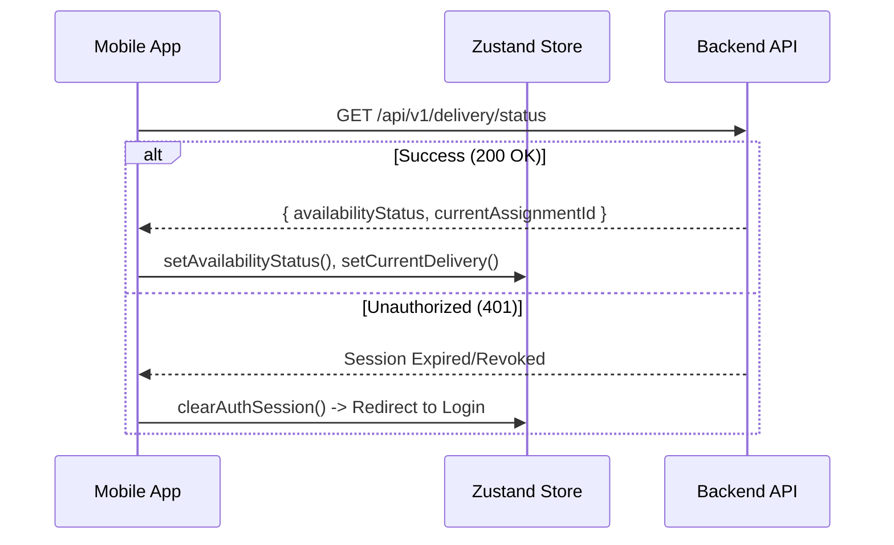

# Phase 6 Rider Availability & App Integration Architecture

## Goal

This document defines the architecture, boundary, visual tokens, and synchronization flow for **Module 5 — Delivery Agent App — Availability**.

It establishes how the React Native agent app manages rider presence, maps backend profile completeness rules into interactive dashboards, and transitions backend route groups to standard JWT-based authorization, replacing placeholder headers.

---

## 1. Boundary & Scope

### In Scope
1. **JWT Auth Transition:** Replacing the temporary `x-agent-id` headers on backend endpoints (`/api/v1/delivery/*`) with standard JWT session verification.
2. **Backend Authentication Middleware:** Developing `authenticateDeliveryAgent` middleware to resolve standard authenticated `req.user.userId` to the corresponding Mongoose `DeliveryAgent` entity.
3. **React Native API Clients:** Integrating Axios-based network operations pointing to:
   - `GET /api/v1/delivery/profile`
   - `PATCH /api/v1/delivery/availability`
   - `GET /api/v1/delivery/status`
4. **Zustand & React Query State:** Maintaining presence states in `useDeliveryStore` with automatic background status polling in TanStack Query.
5. **Interactive UI Switch:** Constructing a beautiful, animated toggle in the home screen utilizing modern curated HSL styles.
6. **Completeness Guards:** Preventing unverified/incomplete riders from toggling online, and displaying specific, helpful warnings when `DELIVERY_AGENT_PROFILE_INCOMPLETE` is thrown.

### Out of Scope (Deferred to Phase 7+)
1. **Live Geolocation Heartbeats:** Sending continuous GPS coordinates from the background.
2. **Rider Acceptance/Rejection Panel:** Screen overlays to accept assignments (owned by Module 6).
3. **Store Picking & Customer Maps:** (Owned by Module 8 & 10 & 13).

---

## 2. Visual Design & HSL Tokens

To create a premium, high-fidelity experience, the availability screen utilizes glassmorphism panels overlaid on dark backgrounds with curated HSL colors:

* **Backgrounds & Panels:**
  - Dark Surface: `hsl(222, 47%, 11%)` (Deep slate)
  - Card Panel: `hsla(217, 33%, 17%, 0.75)` with `backdrop-filter: blur(12px)`
  - Card Border: `hsla(217, 33%, 25%, 0.5)`
* **Interactive Status Colors:**
  - **Online State (Available):** Neon Green Glow
    - Solid HSL: `hsl(142, 70%, 45%)`
    - Soft Glow: `hsla(142, 70%, 45%, 0.15)`
    - Label: `ONLINE — Ready to accept orders`
  - **Offline State (Inactive):** Sleek Slate Gray
    - Solid HSL: `hsl(215, 15%, 45%)`
    - Soft Shadow: `hsla(215, 15%, 15%, 0.2)`
    - Label: `OFFLINE — Go online to start receiving orders`
  - **On Duty State (Busy):** Amber Yellow Accent
    - Solid HSL: `hsl(45, 90%, 48%)`
    - Soft Glow: `hsla(45, 90%, 48%, 0.15)`
    - Label: `ON DUTY — Delivery in progress`

---

## 3. Client-Server State Sync Routines

### App Boot Synchronization
On app initialization, the app boots and performs the following tasks:

### Optimistic Mutation Flow
To achieve micro-animations and zero latency, toggling availability uses optimistic status transitions:
1. **Action:** Agent clicks toggle switch to transition state.
2. **Optimistic Write:** Update Zustand `availabilityStatus` immediately on the client and render green/gray colors.
3. **Dispatch:** Trigger the backend `PATCH /api/v1/delivery/availability`.
4. **Resolution:**
   - **On Success:** Keep the new state.
   - **On Failure (e.g. Incomplete profile):** Revert Zustand state to the previous status, render the error dialog explaining the missing details, and log the conflict event.

---

## 4. Profile Completeness Warnings

If an agent attempts to go `online` while their profile lacks critical criteria, the server rejects the request with:
* **HTTP Status:** 409 Conflict
* **Error Code:** `DELIVERY_AGENT_PROFILE_INCOMPLETE`
* **Message:** Details of the unmet requirements.

The frontend must parse this payload and render a sleek Bottom Sheet checklist indicating exactly what is required:
* `[x]` Phone & Name Recorded
* `[ ]` Operating City Allocated (`cityId` is not null)
* `[ ]` Approved by Admin (`isVerified === true`)
* `[ ]` Vehicle Number Registered (`vehicleNumber` present)

*Note: Going offline requires no validation and is always processed immediately for rider safety.*
