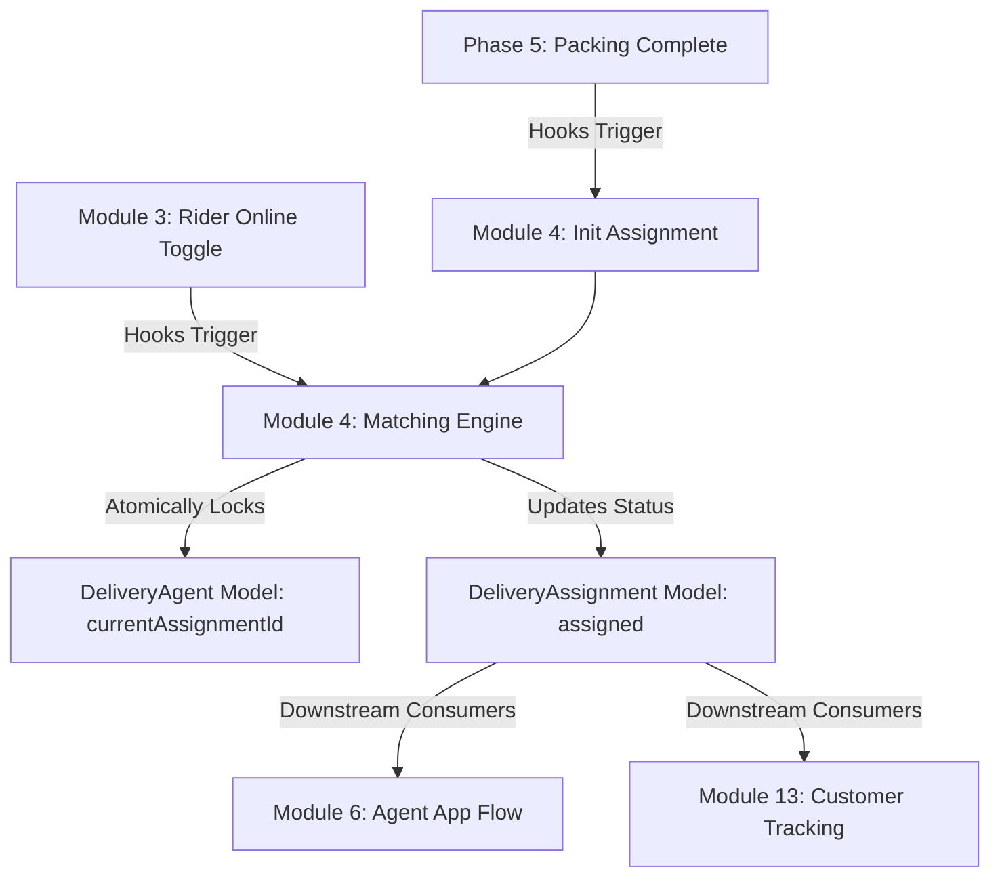

# Phase 6 Module 4 — Delivery Assignment Backend Architecture Plan

## Scope

This document details the architectural boundaries, database designs, matching engine heuristics, integration flows, and validation rules for the Phase 6 delivery auto-assignment dispatch engine.

**Sources:**
- `projectin micro/docfive/PhaesDetail6,7&8.pdf` (Phase 6 delivery lifecycle)
- `docs/architecture/phase-6-delivery-lifecycle-architecture.md` (Module 1 scope)
- `docs/contracts/delivery-state-transition-matrix.md` (delivery state change allowed paths)

---

## Objective

Establish a robust, highly reliable, and thread-safe delivery dispatch backend that automatically triggers when a store marks an order `ready_for_pickup` (Phase 5). The engine matches the order with the oldest idle, active, online, and verified rider within the order's operating city, locking the rider and updating the delivery assignment status.

---

## Architectural Boundaries

### 1. What This Module Builds
- **Delivery Assignment Persistence Schema:** A Mongoose schema (`DeliveryAssignment`) storing the lifecycle state of delivery records, linked uniquely to an `Order`.
- **Auto-Assignment Matching Engine:** Specialized matching logic query that runs in real-time on `ready_for_pickup` triggers or rider `online` status toggles.
- **Rider Selection Rule (Oldest Idle):** Query logic selects the first matching online delivery agent in the city sorted by oldest status update.
- **Atomic Double-Booking Prevention:** Locks both agent and delivery atomically, guarding against race conditions.
- **Integration Handshake Hook:** Integrates picking/packing workflow transition to auto-spawn the corresponding active delivery.
- **Agent Notification Placeholder Publisher:** Spawns database entries representing push notification events for assigned riders.
- **Manual Admin Dispatch Controller:** REST endpoint allowing manual re-matching triggers or pending list reviews.

### 2. What Is Deferred
- **WebSocket Presence & Live Streaming:** Real-time geo-tracking and socket connections (Phase 7+).
- **Geographic Distance Engine (H3/Google Maps):** Multi-agent routing, batching, and geo-polygon queries (Phase 7+).
- **Earnings Ledger Reconciliation:** Financial accounting, settlement ledgering, and driver payout calculation hooks (Phase 7+).

---

## Upstream & Downstream Dependencies

### Upstream Dependencies:
- **Module 2 (Agent Profiles):** Relies on `DeliveryAgentModel` schema fields (`vehicleNumber`, `isVerified`, `isActive`, `cityId`).
- **Module 3 (Availability Presence):** Evaluates `availabilityStatus === 'online'` as a prerequisite for dispatching.
- **Phase 6 Error System:** Emits standardized delivery-specific codes (e.g. `DELIVERY_AGENT_UNAVAILABLE`, `DELIVERY_ORDER_NOT_READY_FOR_PICKUP`).

### Downstream Consumers:
- **Module 5 & 6 (Agent UI / Acceptance):** Exposes active assignment payloads for acceptance and store arrival steps.
- **Module 13 (Customer Tracking):** Serves status feeds showing assigned rider profile snapshots.
- **Module 14 (Vendor visibility):** Exposes assigned rider information to vendor store dashboards.
- **Module 15 & 16 (Admin Override & SLA escalation):** Provides state records for escalation evaluations.

---

## Database Modeling Outline

### Deliveries Collection (`deliveries`):
- `orderId`: Ref: Order (Unique)
- `customerId`: Ref: Customer
- `storeId`: Ref: Store
- `cityId`: Ref: City
- `deliveryAgentId`: Ref: DeliveryAgent (Nullable, indexable)
- `deliveryStatus`: Enum (`pending_assignment`, `assigned`, etc.)
- `timeline`: State change snapshots tracking action histories.

### Atomic Locking Safeties:
- **Rider Occupation Check:** Prior to updating, matching checks `currentAssignmentId: null`. 
- **Atomic Operations:** Employs atomic find-and-modify queries (`findOneAndUpdate` in Mongoose) to prevent race conditions during parallel processing of matches.

---

## Verification Strategy

Automated route and service unit tests will simulate parallel dispatch executions, unapproved agent toggle blocks, out-of-city filtering, and double-booking race condition scenarios.
