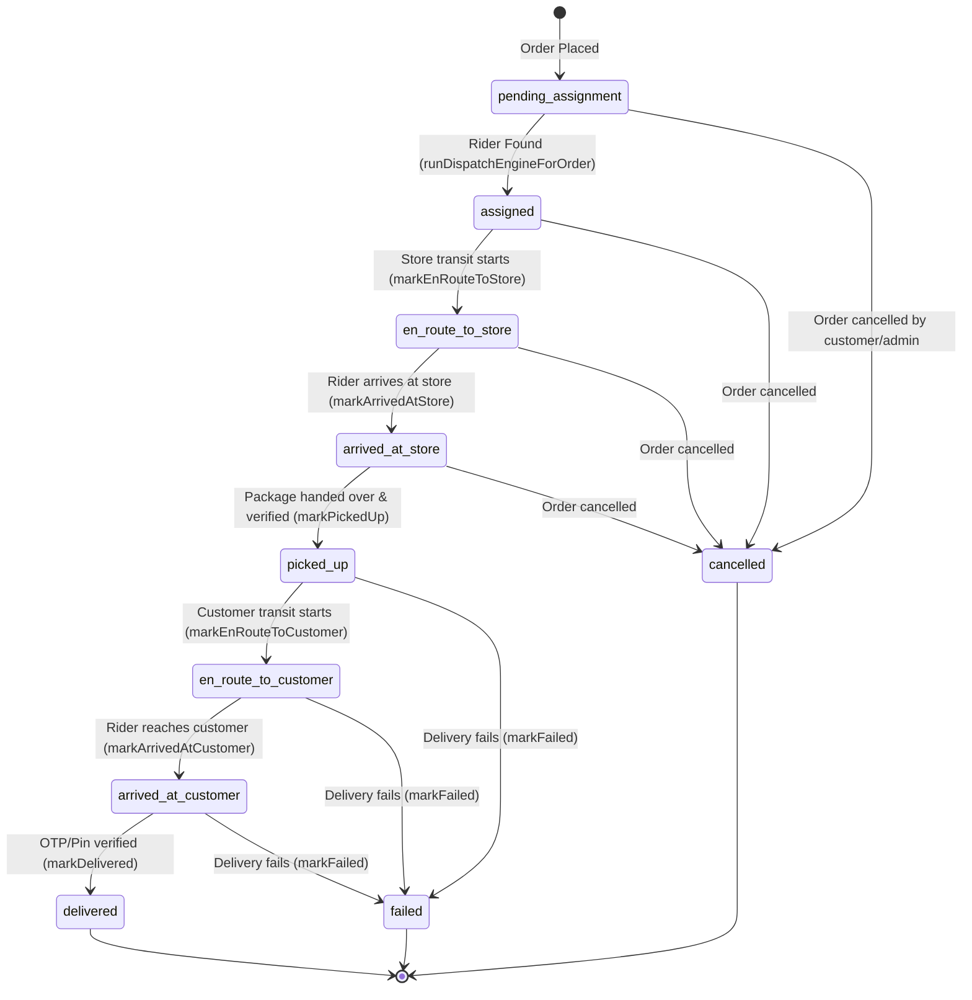

# Phase 6 Cross-Surface Integration Architecture Review

**Phase:** Phase 6 - Delivery Lifecycle
**Module:** 19 - Phase 6 Integration & Review
**Status:** Complete
**Date:** 2026-05-29

## Delivery State Machine & Lifecycle Transitions

The central delivery lifecycle is governed by the state transitions persisted in the `delivery_assignments` collection. The state machine operates sequentially, transitioning through well-defined validation guards:



## Cross-Surface Architecture Data Flow

Information is synchronized dynamically across the four applications in real time through state synchronization hooks:

1. **Customer App (Delivery Tracking)**:
   - Queries `GET /api/v1/customer/deliveries/{deliveryId}/track`.
   - Visualizes live delivery agent coordinates, profile info (name, vehicle, contact), and stage-appropriate status notifications (e.g., "Rider is heading to the store", "Rider has picked up your package").
2. **Delivery Agent App (Rider Workflows)**:
   - Manages online/offline toggle via `PUT /api/v1/delivery-agents/status`.
   - Polling checks for auto-assigned work, acknowledging dispatch assignments, and triggering location/transit transitions (`markArrivedAtStore`, `markPickedUp`, `markEnRouteToCustomer`, `markArrivedAtCustomer`, `markDelivered`).
3. **Vendor Panel (Pickup Visibility)**:
   - Displays real-time rider queue via `GET /api/v1/store/orders`.
   - Lists riders currently `en_route_to_store` or `arrived_at_store` to prepare picking and packing handovers efficiently.
4. **Admin Dashboard (Operational Management & SLAs)**:
   - Central control room queries `GET /api/v1/admin/deliveries`.
   - Monitors individual SLA statuses (on-time, at-risk, breached), handles rider profiles, manually re-assigns deliveries when necessary, and overrides statuses.

## Concurrent SLA Evaluation Mechanics

SLA monitoring runs concurrently for both individual transition stages and overall journey completion time:

| SLA Stage | Starts At | Ends At | At-Risk (Minutes) | Breach (Minutes) |
|---|---|---|---|---|
| **Assignment** | `createdAt` (order checked-in) | `assignedAt` (rider matched) | 3 | 5 |
| **Pickup** | `assignedAt` | `pickedUpAt` (rider picked package) | 10 | 15 |
| **Drop** | `pickedUpAt` | `deliveredAt` (rider delivered package) | 20 | 30 |
| **Total Journey** | `createdAt` | `deliveredAt` | Infinity | 45 |

### SLA cron sweep:
An internal scheduler triggers the `POST /api/v1/internal/delivery-sla/evaluate` endpoint. This runs `markDelayedDeliveriesForSla` which sweeps all active deliveries, marks newly breached ones as `breached` with `slaBreachedStage` (`assignment` \| `pickup` \| `drop` \| `total`), and writes transition events to the timeline and audit logs.

## Audit Logs & Non-Blocking Notification Publisher

All key transitions write audit logs via `writeAuditLog` and dispatch placeholder notifications. Both are isolated behind robust try/catch blocks to ensure that database failures or messaging bottlenecks never block core transition write actions.

- **Standard Log Payload**:
  ```typescript
  {
    eventType: 'delivery.assigned', // or 'delivery.sla.breached', etc.
    actorId: riderId,
    actorRole: 'delivery_agent',
    actorSurface: 'delivery-agent-app',
    entityType: 'delivery',
    entityId: deliveryId,
    storeId: storeId,
    cityId: cityId,
    status: 'success',
    metadata: { ... }
  }
  ```
- **Timeline Records**: Built-in array on `delivery_assignments` stores transition objects: `{ actorType: 'rider' | 'system', actorId, fromStatus, toStatus, reason, createdAt }`.
