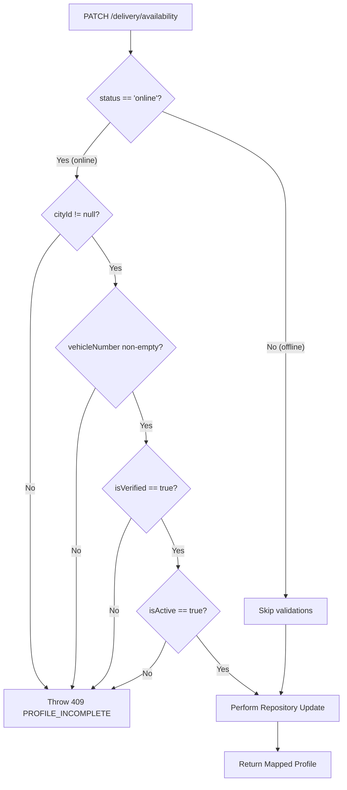

# Phase 6 Rider Availability & Online Status API — Contract

## Scope

This document defines the exact API contract for the Rider Availability & Online Status endpoints implemented by **Phase 6 Module 3 — Rider Availability & Online Status**.

**Module:** 3 — Rider Availability & Online Status
**Source:** `docs/architecture/phase-6-rider-availability-online-status.md`

---

## Endpoint Summary

| Method | Path | Actor | Permission | Purpose |
|--------|------|-------|------------|---------|
| PATCH | `/api/v1/delivery/availability` | Delivery Agent | Authenticated agent | Toggle availability status between `online` and `offline` |
| GET | `/api/v1/delivery/status` | Delivery Agent | Authenticated agent | Retrieve lightweight presence status and active assignment ID |

---

## Auth

These routes use the placeholder authentication middleware that reads the agent's ID from the `x-agent-id` request header. This placeholder is annotated with `// TODO: replace with real delivery agent auth middleware`.

Real JWT authentication for delivery agents is deferred to frontend integration in later modules. The `x-agent-id` value is treated as the agent's Mongoose `_id` in the `delivery_agents` collection.

---

## Endpoint 1 — PATCH /api/v1/delivery/availability

**Purpose:** Toggle the availability status of the authenticated delivery agent between `online` and `offline`.

**Auth:** Placeholder `x-agent-id` header (Module 5 will replace with JWT).

**Request:**

```http
PATCH /api/v1/delivery/availability
x-agent-id: <agentId>
Content-Type: application/json
```

**Request Body:**

```json
{
  "status": "online"
}
```

*Fields description:*
* `status` (string, required): Must be exactly `"online"` or `"offline"`.

**Success Response — 200 OK:**
Returns the updated `DeliveryAgentProfileResponse` wrapper.

```json
{
  "success": true,
  "message": "Availability status updated successfully",
  "data": {
    "agentId": "string (ObjectId)",
    "userId": "string (ObjectId)",
    "name": "string",
    "phone": "string",
    "email": "string | null",
    "profilePhotoUrl": "string | null",
    "vehicleType": "bike | scooter | bicycle | foot",
    "vehicleNumber": "string",
    "availabilityStatus": "online",
    "cityId": "string (ObjectId)",
    "currentAssignmentId": "string (ObjectId) | null",
    "totalDeliveries": 0,
    "createdAt": "ISO8601 string",
    "updatedAt": "ISO8601 string"
  },
  "meta": {}
}
```

**Error Responses:**

| Code | HTTP | Description |
|------|------|-------------|
| `DELIVERY_AGENT_NOT_FOUND` | 404 | No delivery agent record found for the given `x-agent-id` |
| `DELIVERY_AGENT_PROFILE_INCOMPLETE` | 409 | The profile checks failed when trying to go online (e.g. `cityId` is null, `vehicleNumber` is null/empty, `isVerified` is false, or `isActive` is false) |
| `VALIDATION_ERROR` | 422 | The request body validation failed (e.g. missing `status`, or value is not `'online'` or `'offline'`) |

---

## Endpoint 2 — GET /api/v1/delivery/status

**Purpose:** Retrieve a lightweight payload containing the current presence state and any active assignment ID to optimize mobile app syncs.

**Auth:** Placeholder `x-agent-id` header (Module 5 will replace with JWT).

**Request:**

```http
GET /api/v1/delivery/status
x-agent-id: <agentId>
```

No request body. No query parameters.

**Success Response — 200 OK:**

```json
{
  "success": true,
  "message": "Availability status fetched successfully",
  "data": {
    "availabilityStatus": "online | offline",
    "currentAssignmentId": "string (ObjectId) | null"
  },
  "meta": {}
}
```

**Error Responses:**

| Code | HTTP | Description |
|------|------|-------------|
| `DELIVERY_AGENT_NOT_FOUND` | 404 | No delivery agent record found for the given `x-agent-id` |

---

## Profile Completeness Validation Flow



---

## Error Codes Reference

All error codes below are registered in `docs/errors/phase-6-delivery-error-codes.md` and `backend/api/src/errors/error-codes.ts`.

| Error Code | HTTP Status | Description |
|------------|-------------|-------------|
| `DELIVERY_AGENT_NOT_FOUND` | 404 | No agent with the given ID |
| `DELIVERY_AGENT_PROFILE_INCOMPLETE` | 409 | Profile is missing cityId, vehicleNumber, or unverified/inactive |
| `VALIDATION_ERROR` | 422 | Request body failed Zod validation |
