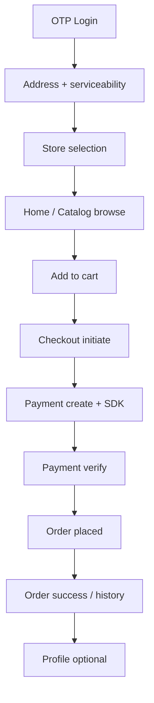

# Phase 4 Customer Journey Integration Review

**Date:** 2026-05-19

## Happy path

| Step | Backend | App screen |
|------|---------|------------|
| 1 Auth | Phase 2 public auth | Login |
| 2 Location | addresses, serviceability, store-selection | AddressList |
| 3 Home | GET /home | CustomerHomeScreen |
| 4 Browse | catalog products/search | Category/Search/Detail |
| 5 Cart | cart CRUD | Cart + quick-add |
| 6 Checkout | checkout initiate/summary | CheckoutScreen |
| 7 Pay | payments create/verify | Razorpay |
| 8 Order | orders + verify side effect | OrderSuccess |
| 9 Profile | GET/PATCH profile | CustomerProfileScreen |

## Failure branches

| Branch | Behavior | Status |
|--------|----------|--------|
| Unserviceable address | Error from serviceability API | PASS |
| OOS product | No quick-add; detail disabled | PASS |
| Checkout cancel | Releases locks | PASS |
| Reservation expired | Checkout/payment rejected | PASS |
| Payment fail | User retry; no order | PASS |
| Verify without orderId | App shows error state | PASS |

## Backend authority

- Final totals from server cart/checkout — **PASS**
- Stock via locks, not client — **PASS**

**Overall: PASS** (automated); device E2E **PENDING** operator
